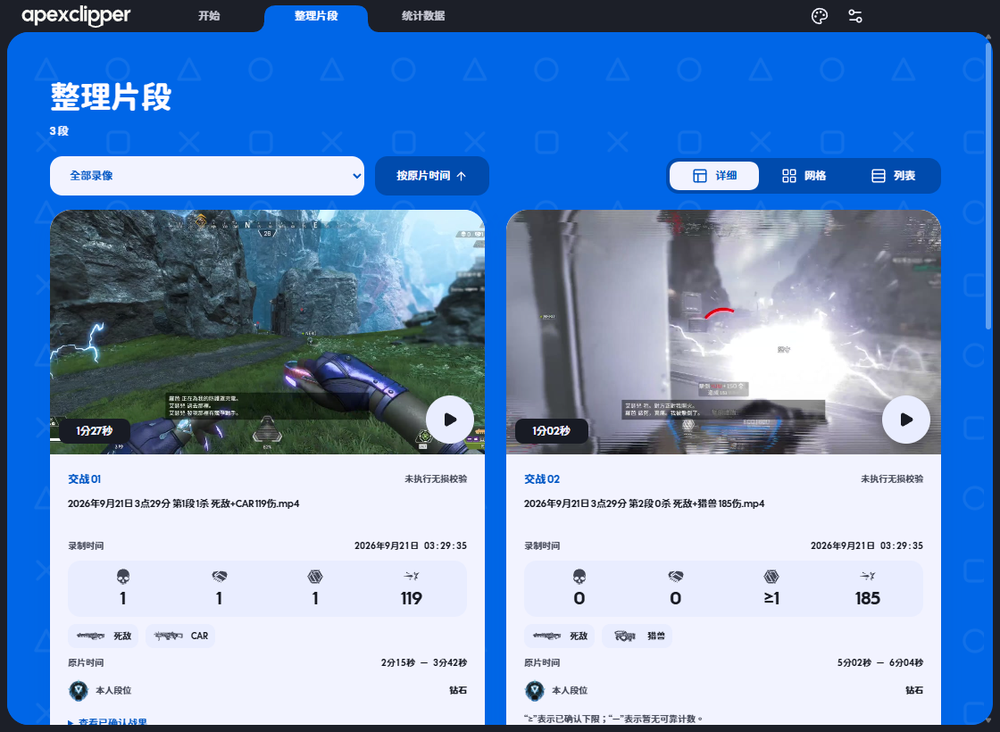
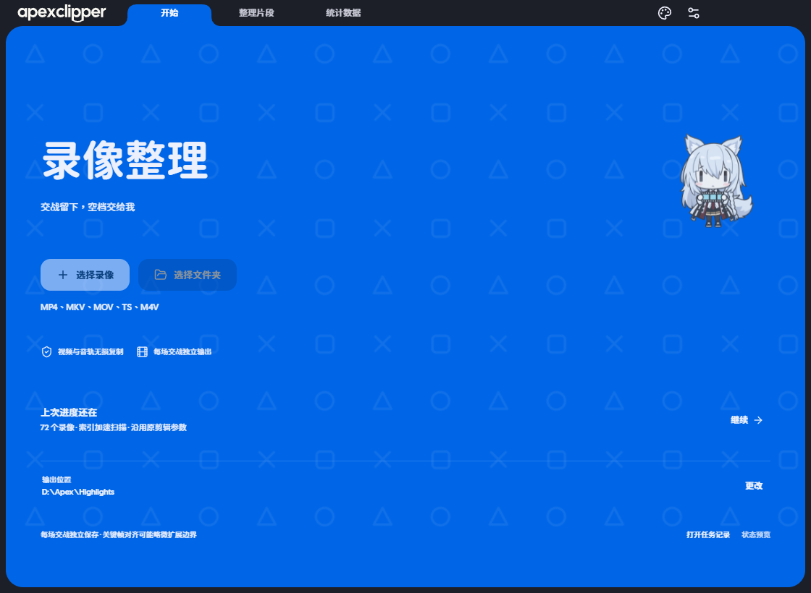
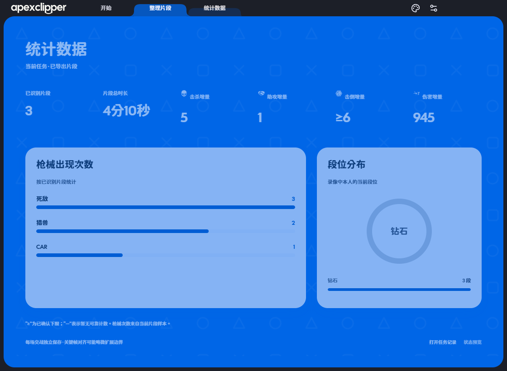
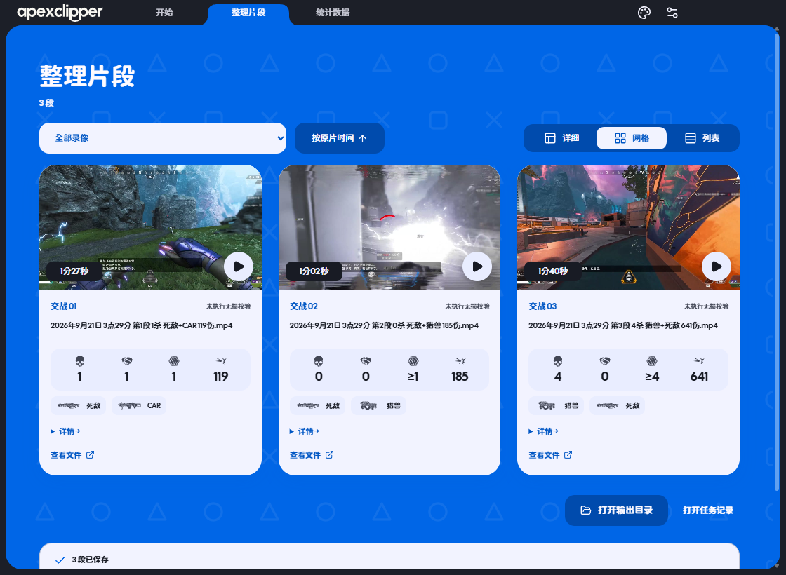
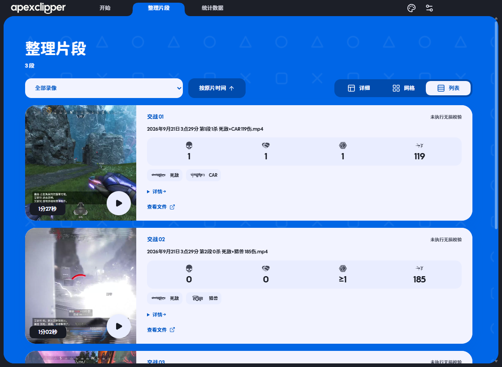
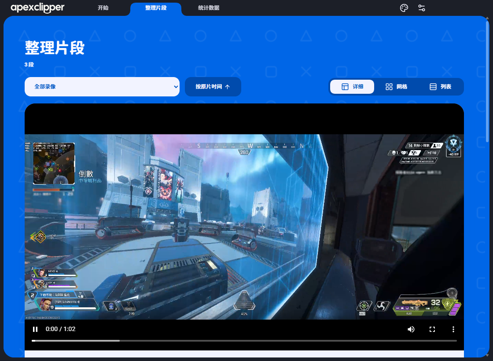
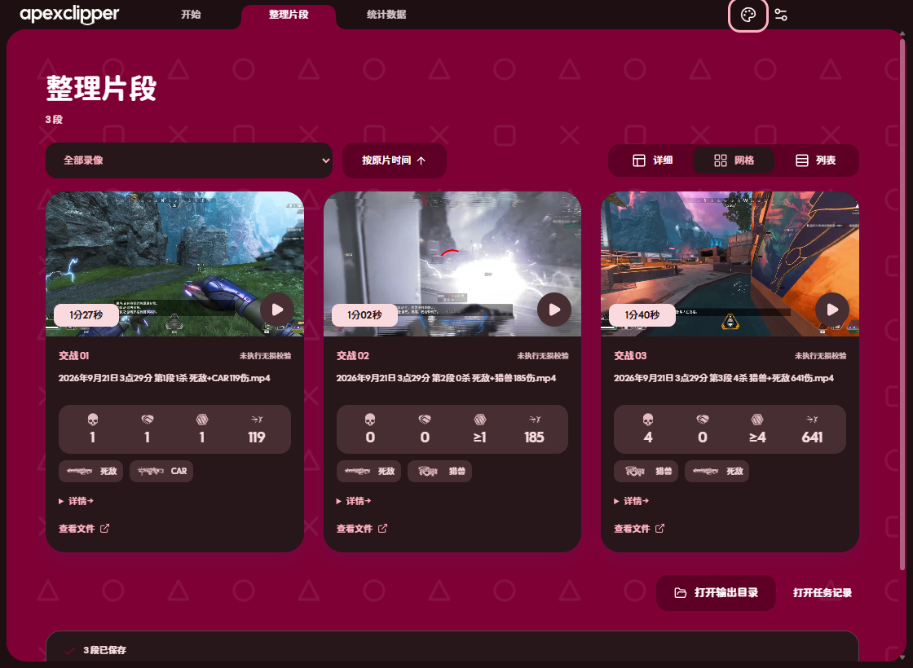

# Apex Highlight Clipper

**交战留下，空档交给我。**

本地批量识别 Apex Legends 交战 · 每段独立输出 · 视频与全部音轨无损复制

[下载 Windows 版](https://github.com/LilycleHeart/apex-highlight-clipper/releases/latest) · [开发说明](docs/development.md) · [第三方资源](docs/third-party.md)

  

<table><tr><td></td><td></td></tr><tr><td></td><td></td></tr></table>

以上为实际 Electron 应用截图。战绩和缩略图来自验证用的已导出录像，展示的是当前片段样本。

## 下载即用

1. 在 [Releases](https://github.com/LilycleHeart/apex-highlight-clipper/releases/latest) 下载 Apex-Clipper-0.2.0-Windows-x64.zip，完整解压到可写目录。
2. 双击 **Start.cmd**。包内已附 CPU / DirectML Python 运行环境和 OCR 模型，无需另装 Python 或 Node.js。
3. 首次启动联网准备 FFmpeg 9.0.2，下载后核对固定 SHA256。也可自行将 ffmpeg.exe、ffprobe.exe 放进包内 tools/，之后可离线剪辑。
4. 选择录像或文件夹，设置输出位置，点击“开始整理”。停止时保存断点，下次继续原批次。

支持 Windows 10 / 11 x64。GPU 使用 DirectML，默认低占用；识别设备可以改为 CPU。发布包未签名，附 SHA256SUMS.txt 及包内文件校验清单。程序不会上传录像。

## 交战与片段

- **最新索引算法默认启用**：关键帧定位、区间细查、伤害 / 击杀终值审计和本人战果提示共同判断，支持拉扯、长 TTK 和本人倒地后的队友续战。
- **按本人战果保留**：至少确认击倒、助攻或消灭之一；只有伤害的候选跳过，矛盾或无法确定的候选留待复核。
- **每场交战一段 MP4**：FFmpeg stream copy，不重编码、不合并成长视频。保留全部音轨，关键帧对齐可能略向外扩展起止时间。
- **三种片段视图**：详细卡片、紧凑网格、列表共用来源、时间排序和选择状态。完整文件名、日期时间、枪械、段位、原片区间、校验状态和战果证据均可查看。
- **应用内播放**：点击当前卡片展开为整行，邻卡让位。原生进度、音量、暂停与全屏；切换片段停止旧播放器，切换视图保留当前播放位置。

## 可调，也能续接

| 选项 | 行为 |
| --- | --- |
| GPU 负载 | 低占用 / 均衡 / 全速；控制工作节奏，不是固定百分比上限 |
| 细查频率 | 默认 2 帧/秒，独立于源视频 FPS；新任务最低 1 帧/秒 |
| 合并间隔、前后保留 | 按你的拉扯节奏调整，内核继续判断倒地后的战斗延续 |
| 最低伤害、击杀、助攻 | 0 为不限，可选任一项或全部设置项达标；确定未达标不导出，不确定则待复核 |
| 无损校验 | 核对视频与全部音轨的压缩包 |
| 导出后回收原录像 | 与校验独立。成功导出且没有待复核内容时移入 Windows 回收站；失败或缺片保留原录像 |
| 断点续接 | 原任务参数和算法版本冻结，已完成输出不重复导出；运行时追加录像进入下一批 |

窗口关闭时先保存断点再退出，不会在关闭窗口后假称后台继续处理。

## 看懂识别结果

战绩栏使用原有游戏图形，依次为 **击杀 / 助攻 / 击倒 / 伤害**。鼠标悬停显示中文说明。

- 2：可靠的本段增量。
- ≥2：已经确认至少 2 次，证据不足以断言完整总数。
- —：暂无可靠计数，不会把缺失数据填成 0。

最后一队结束时，优先使用可靠结算增量；没有结算页时补查中下方本人提示。缓存中缺失计数可以从已有画面补读，原片已回收时也不需要重新导出。模糊、遮挡或矛盾的数据仍可能保持“—”。

段位来自录像中本人的 HUD，不确定时显示“未识别”。统计页只汇总当前任务已导出的片段，枪械次数表示片段样本中的出现次数。

## 界面与动效

36px 标题栏、慢速斜向手柄图案、三页导航和圆体排版。卡片从下方浮现，详细/网格/列表选择器连续舒展、回流并支持途中反向。导航由页面边缘升起，抽屉与卡片在边界舒展；视频、文字和数字保持正常比例。途中反向从可见状态继续，切到后台暂停时钟，减少动效时直接收敛。

浅色、深色、跟随系统模式可切换并持久化。色轮主色即时更新工作区、标题栏、抽屉、卡片与选中态，取色使用官方 @material/material-color-utilities，经 HCT 与语义方案生成明暗配色，前景/背景自动配对以保证可读性；同帧取色合并并缓存计算结果。

两套 Blanca 角色可切换或关闭。以转身更换贴图，降低动作频率；开关沿人物 → 虚线轮廓 → 消失的过程往返，并使用“消失”“复原”音效。角色固定在页面内。

设置提供手动更新检查及启动检查开关，每 24 小时最多自动查询一次本项目正式 Release，不自动安装更新。

## 当前适配范围

识别主要按 **2560 × 1080 HUD** 校准，其他分辨率、比例、语言或 HUD 布局需要校准 profile / 模板。硬件视频解码已在 NVIDIA CUDA 路径验证；其他硬件可以使用 CPU 解码 / 识别。

这是本地视觉识别工具，画面完全遮住战绩时无法恢复不存在的证据。阈值筛选对未知值和已确认下限采用保守规则，不会为了凑数伪造统计。

## 从源码运行

需要 Python 3.11、Node.js 24，以及 FFmpeg / FFprobe。

先创建 .venv 并安装 requirements.txt，运行 setup_weapon_model.py 下载并校验模型。GPU 使用 setup_gpu.ps1 建立独立 .gpu-venv。scripts/setup-ffmpeg.ps1 可准备固定版本工具，已有安装可通过 APEX_FFMPEG_DIR 指定。

在 electron-ui/ 运行 npm ci、npm run build、npm start。Python 回归使用 python -m unittest discover -p "test_*.py"，界面回归使用 npm run validate。

桌面打包目录本身仅包含 Electron 界面。发布用的完整运行包由 scripts/build-portable.py 收集内核、必要模板、模型、运行环境和许可证；具体见 [开发约定](docs/development.md)。

录像、分析缓存、开发环境、诊断输出、本机配置与临时设计交接包均排除于仓库和发布包。保留可复现构建与必要回归测试。

## 资源与许可

第三方字体、模型、游戏图形和角色素材各自遵守原许可，详见 [第三方资源](docs/third-party.md)。本项目是非官方社区工具，与 EA / Respawn 无隶属关系。
